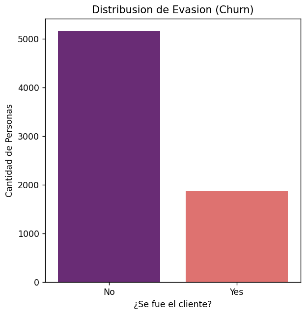
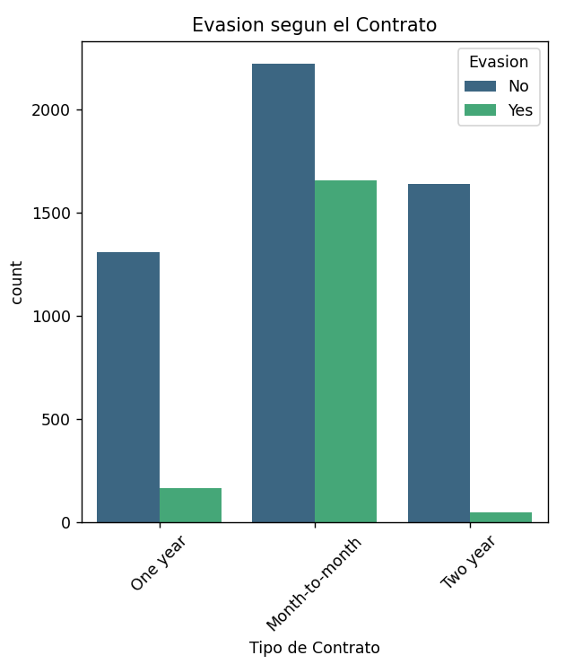
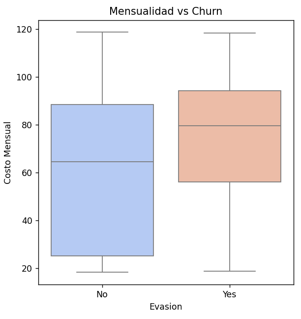

# 📊 Análisis de Evasión de Clientes - Telecom X 🚀

Este proyeto tiene como objetivo analizar los datos de la conpañia "Telecom X" para entender por que los clientes cancelan sus servicios (Churn). Se realizo todo el procceso desde la carga de datos hasta la visualisación de resultados finales.

## 🛠️ Herramientas y Metodología
- **Lenguaje:** Python
- **Librerias:** Pandas (para limpesa), Seaborn y Matplotlib (para gráficas).
- **Procceso:** Se uso `json_normalize` para aplanar los datos anidados del archivo original.

## 📈 Visualisación de Resultados

Para que el análisis sea claro, genere las siguientes gráficas que muestran los puntos mas importantes del abandono de clientes:

### 1. Distribusión de la Evasión
En esta primera gráfica podemos ver la proporción de clientes que se quedan contra los que se van. Es la base para entender el tamaño del problema.

### 2. Evasión segun el Tipo de Contrato
Aqui se nota clarito que los clientes con contratos "Mes a mes" tienen mucha mas fuga que los que firman por uno o dos años. La lealtad sube con contratos largos.

### 3. Mensualidad vs Churn (Punto de quiebre)
En esta gráfica de cajas vemos que los clientes que pagan mensualidades mas altas (arriba de los $70) tienden a irse mas. El presio es un factor determinante.

---

## 🧐 Concluciones e Insights
- **Costo Diario:** Se calculo que el gasto promedio diario de un cliente es de **$2.15 USD**, lo cual es una metrica clave para marketing.
- **Fidelisación:** Los clientes nuevos son los mas volatiles; si pasan el primer año, la probabilidad de que se queden es muchisimo mayor.
- **Recomendasion:** Ofreser beneficios a los usuarios de fibra optica y contratos mensuales para que se pasen a planes anuales y no se vallan con la competencia.

---
*Realizado por una estudiante como parte del Challenge de Alura Latam.*
